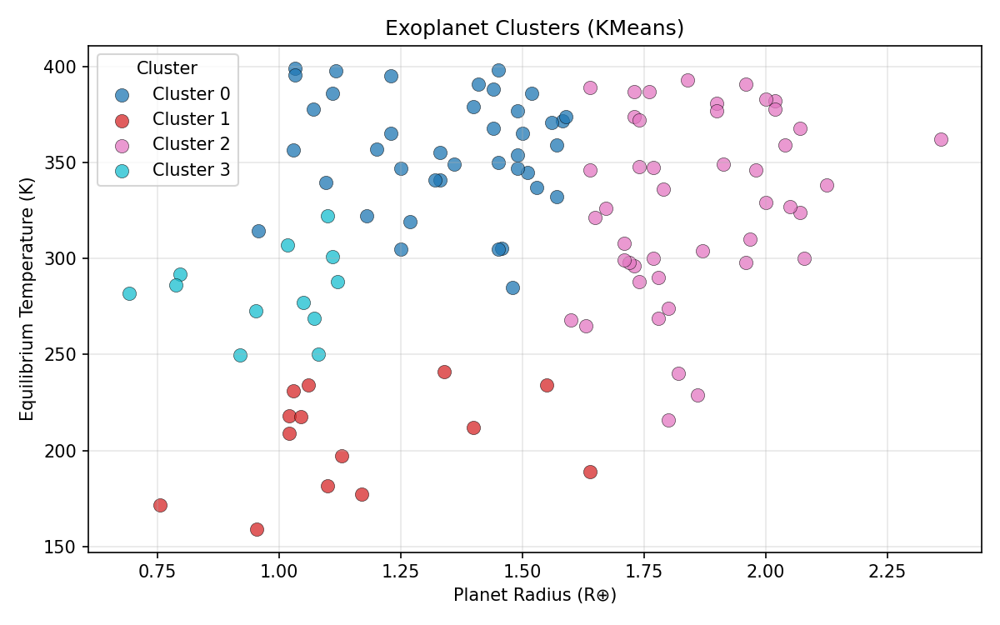
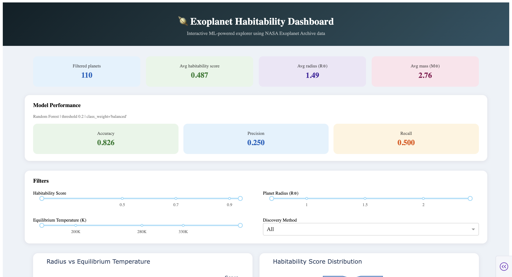
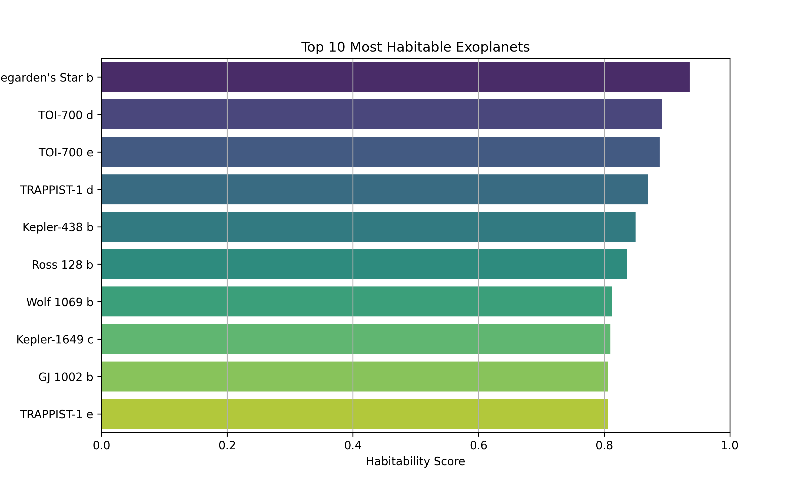

# 🪐 Exoplanet Habitability Analyzer

An end-to-end data science and machine learning project that scores, clusters, and classifies exoplanets by their potential for habitability — using real data from the [NASA Exoplanet Archive](https://exoplanetarchive.ipac.caltech.edu/).



---

## Motivation

With thousands of exoplanets confirmed, identifying which ones are most Earth-like is a core challenge in astrobiology. This project builds a scientifically motivated habitability scoring system inspired by the **Earth Similarity Index (ESI)**, then applies machine learning to classify and cluster planets automatically — wrapped in an interactive dashboard for exploration.

---

## Results & Findings

### Top 10 Most Habitable Exoplanets

| Planet | Radius (R⊕) | Mass (M⊕) | Temp (K) | Score |
|---|---|---|---|---|
| Teegarden's Star b | 1.050 | 1.160 | 277.0 | **0.936** |
| TOI-700 d | 1.073 | 1.250 | 268.8 | 0.892 |
| TOI-700 e | 0.953 | 0.818 | 272.9 | 0.888 |
| TRAPPIST-1 d | 0.788 | 0.388 | 286.2 | 0.870 |
| Kepler-438 b | 1.120 | 1.460 | 288.0 | 0.850 |
| Ross 128 b | 1.110 | 1.400 | 301.0 | 0.836 |
| Wolf 1069 b | 1.080 | 1.260 | 250.1 | 0.813 |
| Kepler-1649 c | 1.060 | 1.200 | 234.0 | 0.810 |
| GJ 1002 b | 1.030 | 1.080 | 230.9 | 0.806 |
| TRAPPIST-1 e | 0.920 | 0.692 | 249.7 | 0.806 |

### KMeans Clustering (4 clusters)

| Cluster | Avg Radius | Avg Mass | Avg Temp | Avg Score | Profile |
|---|---|---|---|---|---|
| 3 | 0.975 | 0.960 | 283K | 0.817 | 🟢 Earth-like |
| 1 | 1.158 | 1.586 | 205K | 0.611 | 🟡 Cool super-Earths |
| 0 | 1.344 | 2.253 | 356K | 0.484 | 🟠 Warm, heavier |
| 2 | 1.854 | 3.988 | 328K | 0.367 | 🔴 Sub-Neptunes |

### Random Forest Classifier

- **5-Fold CV F1 (weighted): 0.735 ± 0.062**
- Trained on 4 habitability tiers: Low / Moderate / High / Very High
- `Low` tier F1: 0.81 — strong performance on the majority class
- Class imbalance handled via `class_weight="balanced"` + threshold tuning

---

## Tech Stack

| Area | Tools |
|---|---|
| Data processing | `pandas`, `numpy` |
| Machine learning | `scikit-learn` (Random Forest, KMeans, StratifiedKFold) |
| Visualization | `plotly`, `matplotlib` |
| Dashboard | `Dash` |
| Model persistence | `joblib` |
| Language | Python 3.13 |

---

## Project Structure

```
exoplanet-habitability/
├── data/
│   ├── clean_exoplanets.csv              # Cleaned NASA dataset (input)
│   └── habitable_scored_exoplanets.csv   # Scored output (generated)
├── models/
│   ├── kmeans_pipeline.pkl               # Trained KMeans model
│   └── rf_classifier.pkl                 # Trained Random Forest model
├── outputs/
│   └── plots/
│       ├── elbow_plot.png
│       ├── cluster_scatter.png
│       ├── confusion_matrix.png
│       └── feature_importance.png
├── src/
│   ├── habitability_score.py             # ESI-inspired scoring pipeline
│   ├── ml_pipeline.py                    # KMeans + Random Forest pipeline
│   └── dashboard.py                      # Interactive Dash dashboard
├── requirements.txt
└── README.md
```

---

## How to Run

### 1. Clone the repo & activate environment

```bash
git clone https://github.com/gauranshika29/exoplanet-habitability-.git
cd exoplanet-habitability
python3 -m venv venv
source venv/bin/activate
pip install -r requirements.txt
```

### 2. Score the planets

```bash
python3 src/habitability_score.py
```

Reads `data/clean_exoplanets.csv`, computes habitability scores, saves `data/habitable_scored_exoplanets.csv`.

### 3. Run the ML pipeline

```bash
python3 src/ml_pipeline.py
```

Runs KMeans clustering and Random Forest classification. Saves models to `models/` and plots to `outputs/plots/`.

### 4. Launch the dashboard

```bash
python3 src/dashboard.py
```
<<<<<<< HEAD

Run `python3 src/dashboard.py` and open [http://127.0.0.1:8050](http://127.0.0.1:8050) in your browser.
=======
Run `python3 src/dashboard.py` and open [http://127.0.0.1:8050](http://127.0.0.1:8050) in your browser.

>>>>>>> b141788 (Add dashboard screenshots to README)
---

## Screenshots

> Add screenshots of your dashboard here after taking them.

| Dashboard Overview | Cluster Scatter | Top 10 Bar Chart |
|---|---|---|
|  |  |  |

---

## Data Source

NASA Exoplanet Archive — [https://exoplanetarchive.ipac.caltech.edu/](https://exoplanetarchive.ipac.caltech.edu/)

---

## Author

**Anshika Gaur**  
[GitHub](https://github.com/gauranshika29) · [LinkedIn](https://www.linkedin.com/in/anshika-gaur-4bb65b221/)